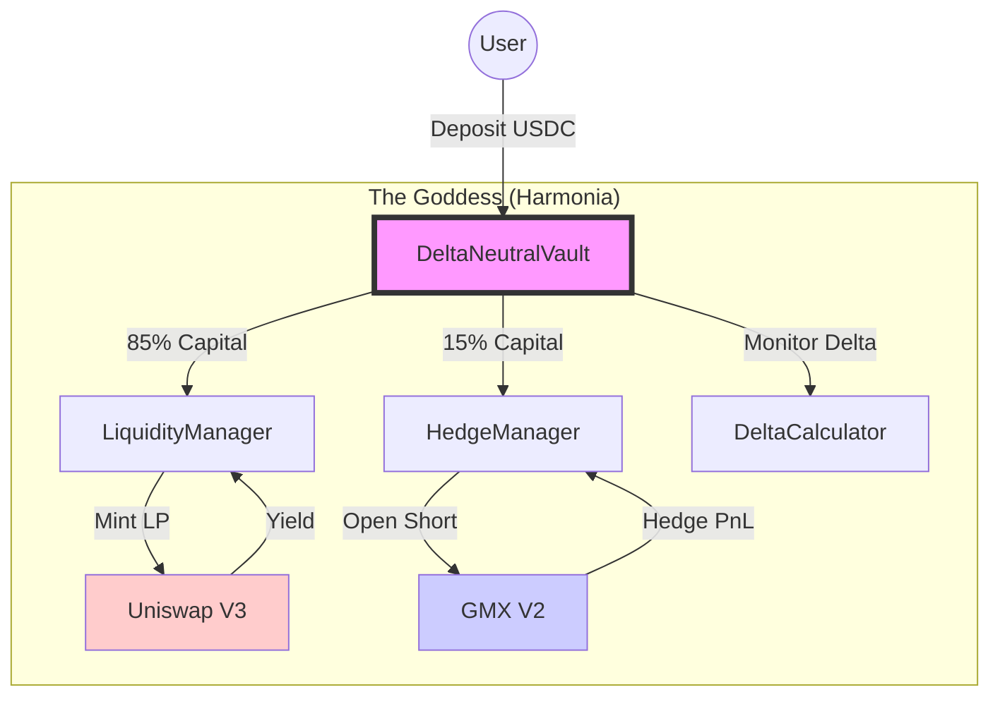

# Harmonia: The Goddess of Delta Neutrality

> "Harmony is the unification of the diverse and the reconciliation of the opposing."

## 1. Introduction: The Search for Harmony

In the chaotic battlefield of Decentralized Finance (DeFi), we often find ourselves torn between two opposing forces: the desire for **Yield** and the fear of **Volatility**.

**Harmonia**, named after the Greek goddess of harmony and concord (the daughter of Ares, god of war, and Aphrodite, goddess of love), is designed to reconcile these forces. She brings balance to the portfolio by neutralizing the "war" of price movements, allowing the "love" of yield to flourish.

### The Core Problem
*   **Uniswap V3** offers exceptional yield through concentrated liquidity.
*   **The Catch:** To earn it, you must take on "Delta" (directional price risk). If the price crashes, you lose value faster than the yield can compensate.

### The Harmonia Solution
Harmonia is a **Delta-Neutral Vault**. She pairs a long liquidity position on Uniswap V3 with a short hedge position on GMX V2. The result? A portfolio that aims to stay stable in value (Delta ≈ 0) regardless of whether the market goes up or down, while continuously harvesting trading fees.

---

## 2. The Titans: Uniswap & GMX

To achieve this balance, Harmonia orchestrates two powerful DeFi protocols.

### The Engine: Uniswap V3
Uniswap V3 allows us to concentrate capital within a specific price range. This boosts capital efficiency and yield but makes the position's "Delta" (exposure to price) dynamic and complex. As price moves, our exposure changes.

### The Shield: GMX V2
GMX V2 is a perpetual futures exchange. It allows us to open a **Short** position with leverage. By shorting the asset we are providing liquidity for, we can cancel out the long exposure from Uniswap.

![Image: A stylized illustration of the Goddess Harmonia standing between two pillars. On the left pillar, a golden unicorn (Uniswap) glows with chaotic energy. On the right, a stoic blue dragon (GMX) stands guard. Harmonia holds golden scales, perfectly balanced, with a stream of light connecting the two beasts. Style: Art Nouveau, intricate linework, gold and teal color palette.]

---

## 3. The Mathematics of Balance: Delta

**Delta ($\Delta$)** measures how much your portfolio's value changes for a $1 change in the underlying asset's price.

*   **Uniswap Position:** Positive Delta (Long). Value drops if price drops.
*   **GMX Position:** Negative Delta (Short). Value rises if price drops.
*   **Harmonia:** Net Delta ≈ 0.

### Code Spotlight: Calculating the LP Delta
One of the most crucial parts of the system is accurately calculating the delta of the Uniswap position so we know exactly how much to hedge.

**File:** `contracts/libraries/DeltaCalculator.sol`

```solidity
    /// @notice Calculate delta of a Uniswap v3 LP position
    /// @dev Delta = L * (1/√S - 1/√Pb) when in range
    function calculateDelta(
        uint160 sqrtPriceX96,
        uint160 sqrtPriceLowerX96,
        uint160 sqrtPriceUpperX96,
        uint128 liquidity
    ) internal pure returns (int256 delta) {
        // ... validation ...

        // In range: partial exposure
        // delta = L * (1/√S - 1/√Pb)
        return int256(_getAmount0ForLiquidity(sqrtPriceX96, sqrtPriceUpperX96, liquidity));
    }
```

This function uses the square root price math of Uniswap to determine the precise amount of "long" exposure we have at any given second.

---

## 4. Harmonia's Architecture

The system is controlled by the `DeltaNeutralVault`, which acts as the central brain. It coordinates two managers:
1.  **LiquidityManager:** Manages the Uniswap NFT.
2.  **HedgeManager:** Manages the GMX Short.

### System Diagram



---

## 5. Crucial Mechanism: The Rebalance

The market never sleeps, and prices always move. As they do, the Uniswap position's delta shifts (Gamma risk). If we don't adjust, our shield (GMX) will no longer match our engine (Uniswap).

The `rebalance` function is the heartbeat of Harmonia.

**File:** `contracts/core/DeltaNeutralVault.sol`

```solidity
    /// @notice Execute rebalance to maintain delta neutrality
    function rebalance(uint256 targetHedgeSize) external {
        // ... access controls ...

        int256 deltaBefore = getNetDelta();

        // 1. Adjust Uniswap Range if needed (out of range)
        // 2. Adjust GMX Short Size to match new Delta
        _executeRebalance(targetHedgeSize);

        int256 deltaAfter = getNetDelta();
        
        emit Rebalanced(deltaBefore, deltaAfter, targetHedgeSize);
    }
```

When the `deltaThreshold` (e.g., 5%) is breached, keepers trigger this function to restore harmony.

![Image: A close-up illustration of the Goddess Harmonia's hands adjusting the mechanism of an intricate orrery (model of the solar system). The planets represent the different tokens. As she turns a gear, the orbits align into perfect concentric circles. Style: Art Nouveau, focus on mechanical details, glowing magical runes.]

---

## 6. Performance & Safety

### The Payoff
By neutralizing delta, we transform the volatile price chart of an asset like ETH into a steady, "up-only" yield chart (assuming yield > hedging costs).

### Chart: Delta Neutrality in Action

```mermaid
xychart-beta
    title "Portfolio Value vs Asset Price"
    x-axis "Time" [1, 2, 3, 4, 5, 6, 7, 8, 9, 10]
    y-axis "Value" 0 --> 150
    line [100, 105, 90, 110, 85, 120, 80, 115, 95, 100] "ETH Price (Volatile)"
    line [100, 101, 102, 103, 104, 105, 106, 107, 108, 109] "Harmonia Vault (Stable Yield)"
```

### Safety First
Harmonia includes a **Circuit Breaker**. If the delta drift becomes too extreme (e.g., a flash crash where GMX liquidity dries up), the system pauses withdrawals to prevent a run on the bank and can be manually unwound by a guardian.

**File:** `contracts/core/DeltaNeutralVault.sol`

```solidity
    /// @notice Emergency threshold for circuit breaker (default 20%)
    uint256 public emergencyThreshold;

    function _checkAndTriggerCircuitBreaker() internal {
        int256 deltaRatio = this.getDeltaRatio();
        if (SecurityModule.checkEmergencyDelta(deltaRatio, emergencyThreshold)) {
            circuitBreakerTriggered = true;
            _pause();
        }
    }
```

---

## 7. Conclusion

Harmonia is not just a vault; it is an active risk management system. By mathematically coupling the high yield of Uniswap with the hedging power of GMX, it fulfills the ancient promise of its namesake: bringing concord to chaos.

![Image: The final slide image. A serene landscape with a futuristic Greek temple. In the center, the Harmonia protocol logo hangs in the air, radiating a soft, stable light that protects the temple from a storm raging outside the columns. Style: Art Nouveau, wide angle, majestic, contrasting calm interior with chaotic exterior.]
