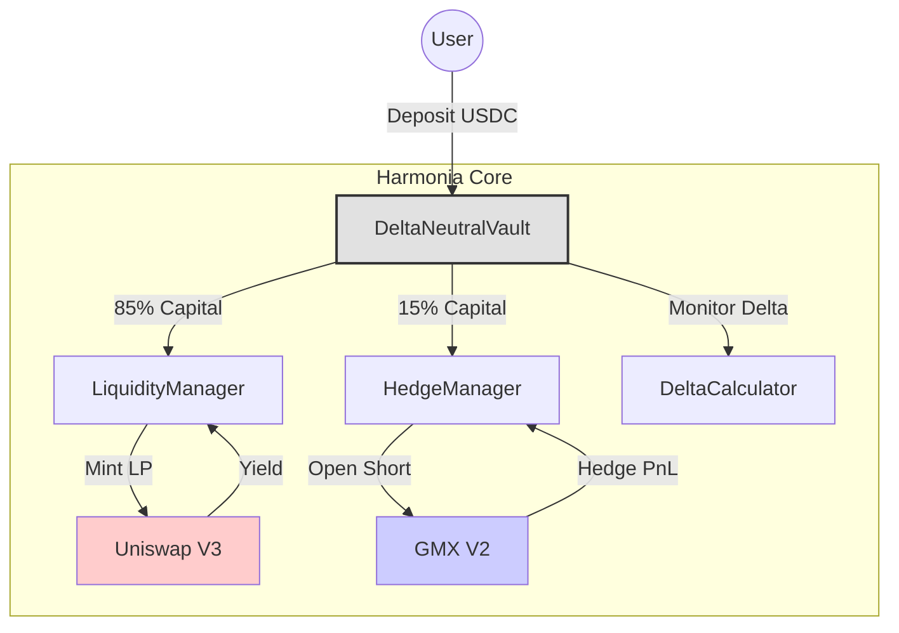

# Harmonia: The Goddess of Delta Neutrality

> "Harmony is the unification of the diverse and the reconciliation of the opposing."

## 1. Introduction: The Reconciliation of Opposites

In Greek mythology, **Harmonia** was the daughter of two opposing forces: **Ares** (War) and **Aphrodite** (Love). Her existence represented the cosmic necessity of balancing conflict with concord. Her marriage to Cadmus, the founder of Thebes, was attended by the Olympians, symbolizing the unification of the divine and the mortal.

This project, named in her honor, attempts a similar reconciliation in the domain of Decentralized Finance: balancing the aggressive pursuit of **Yield** (Ares) with the preservation of **Capital** (Aphrodite).

### The Technical Challenge
*   **Uniswap V3** creates deep liquidity and high yield but exposes the provider to significant directional risk (Delta).
*   **The Objective:** To harness the yield-generation capabilities of Uniswap while neutralizing its inherent volatility exposure.

### The Solution
Harmonia is a **Delta-Neutral Vault**. It harnesses a long liquidity position on Uniswap V3 and pairs it with a short hedge position on GMX V2. The system aims to maintain a Net Delta of approximately zero, effectively isolating the trading fee yield from the underlying asset's price action.

---

## 2. Protocol Integration: Generator and Governor

The system does not merely aggregate protocols; it harnesses them into a single coherent machine.

### The Generator: Uniswap V3
Uniswap V3 functions as the **Yield Generator**. By concentrating capital within a specific price range, it maximizes the accrual of trading fees. However, this efficiency comes at the cost of dynamic Delta exposure. As the price moves, the position's directional risk fluctuates.

### The Governor: GMX V2
GMX V2 functions as the **Risk Governor**. It allows for the creation of a precise Short position with leverage. This component applies a counter-force to the portfolio, canceling out the long exposure generated by Uniswap. Much like a mechanical governor regulates an engine's speed to prevent it from tearing itself apart, the GMX position regulates the portfolio's exposure to prevent capital drawdown during market volatility.

![Image: A technical schematic diagram drawn in the style of an ancient Greek manuscript. On the left, a complex gear system (Uniswap) labeled "GENESIS". On the right, a system of weights and pulleys (GMX) labeled "KRATOS". Connecting them is a central shaft representing the Harmonia vault. The aesthetic is parchment with faded ink, but the diagram itself is precise and engineering-focused.]

---

## 3. The Mathematics of Balance: Delta

**Delta ($\Delta$)** quantifies the sensitivity of the portfolio's value to a unit change in the underlying asset's price.

*   **Uniswap Position:** Positive Delta. $\frac{\partial V}{\partial S} > 0$
*   **GMX Position:** Negative Delta. $\frac{\partial V}{\partial S} < 0$
*   **Harmonia Target:** $\sum \Delta \approx 0$

### Code Spotlight: Calculating LP Exposure
Accurate delta calculation is the foundation of the strategy. We utilize a dedicated library to derive the precise exposure of the Uniswap NFT at any given tick.

**File:** `contracts/libraries/DeltaCalculator.sol`

```solidity
    /// @notice Calculate delta of a Uniswap v3 LP position
    /// @dev Delta = L * (1/√S - 1/√Pb) when in range
    function calculateDelta(
        uint160 sqrtPriceX96,
        uint160 sqrtPriceLowerX96,
        uint160 sqrtPriceUpperX96,
        uint128 liquidity
    ) internal pure returns (int256 delta) {
        // ... validation ...

        // In range: partial exposure
        // delta = L * (1/√S - 1/√Pb)
        return int256(_getAmount0ForLiquidity(sqrtPriceX96, sqrtPriceUpperX96, liquidity));
    }
```

---

## 4. Harmonia's Architecture

The `DeltaNeutralVault` contract serves as the central controller, harnessing two sub-managers to execute the strategy.

### System Diagram



---

## 5. Crucial Mechanism: The Rebalance

Markets are dynamic. As prices shift, the Uniswap position's delta changes (due to Gamma), creating drift. The `rebalance` function restores equilibrium.

**File:** `contracts/core/DeltaNeutralVault.sol`

```solidity
    /// @notice Get the net delta of the combined position
    /// @dev Net delta = LP delta + hedge delta (should be ~0)
    function getNetDelta() public view returns (int256 netDelta) {
        int256 lpDelta = _getLPDelta();
        int256 hedgeDelta = _getHedgeDelta();
        return lpDelta + hedgeDelta;
    }

    /// @notice Execute rebalance to maintain delta neutrality
    function rebalance(uint256 targetHedgeSize) external {
        // ... access controls ...
        
        int256 deltaBefore = getNetDelta();

        // Adjusts Uniswap range if needed, then calculates and executes hedge adjustment
        _executeRebalance(targetHedgeSize);

        int256 deltaAfter = getNetDelta();
        
        emit Rebalanced(deltaBefore, deltaAfter, targetHedgeSize);
    }

    function _executeRebalance(uint256 targetHedgeSize) internal {
        // 1. Check if LP position is in range and adjust if needed
        if (liquidityManager != address(0)) {
            bool inRange = ILiquidityManager(liquidityManager).isInRange();
            if (!inRange) {
                 // ... close current, mint new range ...
            }
        }

        // 2. Adjust hedge to match new LP delta
        // ... calculation logic ...

        if (hedgeManager != address(0)) {
            IHedgeManager(hedgeManager).adjustHedge{value: execFee}(hedgeTarget);
        }
    }
```

---

## 6. Performance & Safety

### The Result
The strategy transforms the volatile price action of an asset like ETH into a more predictable yield curve.

### Chart: Delta Neutrality in Action

```mermaid
xychart-beta
    title "Portfolio Value vs Asset Price"
    x-axis "Time" [1, 2, 3, 4, 5, 6, 7, 8, 9, 10]
    y-axis "Value" 0 --> 150
    line [100, 105, 90, 110, 85, 120, 80, 115, 95, 100] "ETH Price (Volatile)"
    line [100, 101, 102, 103, 104, 105, 106, 107, 108, 109] "Harmonia Vault (Stable Yield)"
```

### Safety First
Harmonia includes a **Circuit Breaker**. If the delta drift becomes too extreme, the system pauses withdrawals to protect remaining capital.

**File:** `contracts/core/DeltaNeutralVault.sol`

```solidity
    function _checkAndTriggerCircuitBreaker() internal {
        int256 deltaRatio = this.getDeltaRatio();
        if (SecurityModule.checkEmergencyDelta(deltaRatio, emergencyThreshold)) {
            circuitBreakerTriggered = true;
            _pause();
        }
    }
```

---

## 7. Conclusion

Harmonia operates as a sophisticated risk management system. By mathematically coupling the high yield of Uniswap with the regulating power of GMX, the protocol isolates yield from volatility. It fulfills the functional requirement of its namesake: enforcing a stable equilibrium between two powerful, opposing forces.

![Image: A detailed architectural drawing of a Greek temple facade. The columns are perfectly vertical, supporting a heavy entablature. Superimposed on the drawing are mathematical annotations—vectors, angles, and load calculations—showing the perfect distribution of forces that keeps the structure standing for millennia. Style: Da Vinci sketch meets architectural blueprint.]
